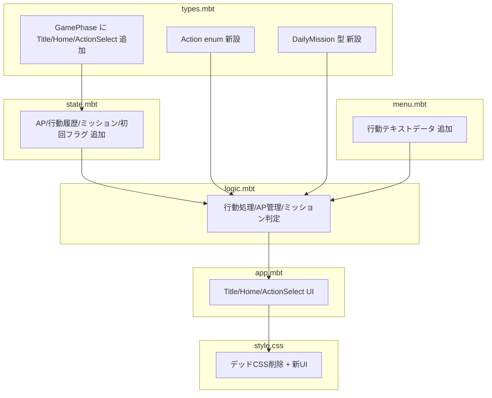

# ゲームシステム再設計: AP行動選択制の導入

## Context

現在の「灯」は Visit → Scene → Story の単線ループ。訪問は1日1回・自動で親密度加算されるだけで、プレイヤーの選択がない。学園アイドルマスターの「限られた行動回数で何を選ぶか」を参考に、**AP行動選択制**を導入する。

**現状のフロー:**
```
Story(ch0) → Visit(灯に入る) → Scene(ひとくちシーン) → Story解放 or 次の日
```

**目標のフロー:**
```
Title → Story(ch0) → Home → ActionSelect → Scene(行動結果) → Home → 次の日
                        ↑                                       |
                        └───────────────────────────────────────┘
```

## 変更の全体像



---

## Step 1: 型定義の拡張 — `src/data/types.mbt`

### GamePhase の変更

```
// 現状
Visit, Scene, Story, Calendar

// 変更後
Title, Home, ActionSelect, Scene, Story, Album
```

- `Title`: 初回起動時のタイトル画面
- `Home`: 日付・AP・ミッション表示。「灯に行く」ボタン
- `ActionSelect`: 灯の中。食べる/観察する/話す を選ぶ
- `Scene`: 行動結果のテキスト表示（既存を流用）
- `Story`: ADVパート（既存そのまま）
- `Album`: 味の記憶 + 発見ノート（Calendar の拡張リネーム）

### 新しい型

```moonbit
pub(all) enum ActionType {
  Eat       // 食べる (2 AP, +10-15 親密度)
  Observe   // 観察する (1 AP, +3-5 親密度)
  Talk      // 丸山と話す (1 AP, +5-8 親密度)
  Special   // 特別行動 (2 AP, +15-25 親密度, ★3で解放)
}

pub(all) struct DailyMission {
  description : String
  completed : Bool
  reward : Int
}
```

### VisitRecord の拡張

`action_type : String` フィールドを追加（アルバムで「何をしたか」表示用）。

---

## Step 2: ステート拡張 — `src/game/state.mbt`

GameState に以下を追加:

```moonbit
// AP（行動ポイント）
ap : @signals.Signal[Int]                    // 現在AP (上限5)

// 行動履歴（今日分）
today_actions : @signals.Signal[Array[String]]  // 今日実行した行動

// デイリーミッション
daily_missions : @signals.Signal[Array[@data.DailyMission]]

// 初回フラグ
is_first_launch : @signals.Signal[Bool]      // true = タイトル画面から開始

// 発見ノート（観察で得た情報のコレクション）
discoveries : @signals.Signal[Array[String]]

// 丸山メモ（話すで得た情報のコレクション）
talk_memos : @signals.Signal[Array[String]]
```

`create_game_state()` の変更:
- `phase` 初期値を `Title` に変更（初回はタイトルから）
- AP初期値: 5
- ミッション初期値: 3つの未完了ミッション

---

## Step 3: ゲームロジック — `src/game/logic.mbt`

### 新しい関数

| 関数 | 役割 |
|------|------|
| `perform_action(state, ActionType)` | AP消費→親密度加算→シーンテキスト設定→Scene遷移 |
| `can_perform_action(state, ActionType) -> Bool` | AP足りるか＆特別行動の★条件チェック |
| `get_action_cost(ActionType) -> Int` | APコスト返却 |
| `go_to_akari(state)` | Home→ActionSelect遷移 |
| `leave_akari(state)` | ActionSelect→Home遷移（帰る） |
| `check_missions(state)` | 行動後にミッション達成チェック＆報酬付与 |
| `reset_daily(state)` | 次の日処理（AP回復、ミッションリセット、行動履歴クリア） |
| `start_game(state)` | Title→Story(ch0) 遷移 |

### `perform_action` の詳細

1. APコストを消費
2. 行動タイプ×親密度段階×日数ハッシュ でテキスト選択（既存 `generate_scene_text` のパターンを拡張）
3. 親密度を加算
4. `today_actions` に追加
5. Observe なら `discoveries` に追加、Talk なら `talk_memos` に追加
6. `check_missions` 呼び出し
7. Scene フェーズへ遷移

### `finish_scene` の変更

Scene終了後、Story解放チェック → 解放なら Story へ、なければ **ActionSelect に戻る**（現状は Visit に戻る）。APが残っていれば追加行動可能。

### `next_day` の変更

`reset_daily` を呼び出して AP=5 に回復、ミッションリセット、Home フェーズへ。

---

## Step 4: 行動テキストデータ — `src/data/menu.mbt`

既存の `get_daily_menus()` はそのまま維持。以下を追加:

### `get_action_texts(action: String, intimacy: Int, day: Int) -> String`

行動タイプ × 親密度段階(4段階) × バリエーション(4種) = 約48テキスト。
既存の `generate_scene_text` を logic.mbt から menu.mbt に移動し、3行動分に拡張。

### `get_discovery_text(intimacy: Int, day: Int) -> String`

観察で得られる発見テキスト（ひよりの好み、店の歴史など）。

### `get_talk_text(intimacy: Int, day: Int) -> String`

丸山から聞ける話テキスト。

---

## Step 5: シナリオ unlock_intimacy 調整 — `src/data/scenario_ch*.mbt`

AP制導入で1日の最大親密度が増える（食べる15 + 観察5 + 話す8 + ミッション報酬35 = 最大63/日）。
現在の値でバランスは概ね問題ないが、★とチャプターの対応をドラフトの表に合わせる:

| ch | 現在 | 変更後 | 備考 |
|----|------|--------|------|
| ch0 | 0 | 0 | 変更なし |
| ch1 | 0 | 30 | ★1内。初日は ch0 のみ |
| ch2 | 80 | 100 | ★2 到達と同時 |
| ch3 | 150 | 200 | ★2 内 |
| ch4 | 250 | 300 | ★3 到達と同時 + 特別行動解放 |
| ch5 | 380 | 450 | ★3 内 |
| ch6 | 500 | 600 | ★4 到達と同時 |
| ch7 | 650 | 750 | ★4 内 |
| ch8 | 850 | 900 | ★5 到達 |
| ch9 | 1000 | 1000 | 変更なし |

**注意**: ch1 を `unlock_intimacy: 30` に変更すると、初回起動時に ch0→ch1 が連続再生されなくなる。ch0 終了後は Home 画面に遷移し、プレイヤーが行動して親密度30に達すると ch1 が解放される。

---

## Step 6: UI — `src/ui/app.mbt`

### 新しいレンダー関数

| 関数 | 内容 |
|------|------|
| `render_title_view(state)` | 「灯」ロゴ + 「はじめる」ボタン |
| `render_home_view(state)` | 日付、AP、今日の日替わり、ミッション、「灯に行く」「アルバム」 |
| `render_action_select_view(state)` | 行動カード3-4枚 + 「帰る」ボタン |
| `render_album_view(state)` | 味の記憶 + 発見ノート + 会話メモ + ストーリー回想（タブ切替） |

### 既存の変更

- `app()`: `show` 分岐を 6 フェーズに拡張
- `render_header()`: AP表示を追加、★をビジュアル表示（★★☆☆☆）
- `render_visit_view()`: → `render_home_view()` にリネーム・大幅改修
- `render_scene_view()`: ボタンテキスト変更（「次へ」→ ActionSelect に戻る旨）
- `render_calendar_view()`: → `render_album_view()` にリネーム・拡張

---

## Step 7: CSS — `style.css`

### 削除対象（使われていないクラス）

以下は `app.mbt` で参照されていない旧カフェ経営UIのスタイル:
- `.business-view` 系 (L180-268): `.business-view`, `.stamina-bar`, `.menu-grid`, `.menu-item*`, `.business-actions`
- `.day-result-view` 系 (L272-357): `.day-result-view`, `.visit-info`, `.visitor-*`, `.visit-dialogue`, `.day-summary`, `.summary-row*`, `.day-result-actions`
- `.missions-panel` 系 (L360-399): 既存のミッション系（新UIで書き直す）
- `.overlay` / `.recipe-book` 系 (L406-470): `.overlay`, `.recipe-book*`, `.recipe-list`, `.recipe-entry`, `.recipe-name`, `.recipe-desc`, `.recipe-costs`
- `.stat.money`, `.stat.stamina` (L107-113)

→ 約200行削除。

### 追加スタイル

- `.title-view`: 全画面中央配置、ロゴ、はじめるボタン
- `.home-view`: 日付ヘッダー、メニューカード、AP表示、ミッションリスト
- `.action-select-view`: 行動カードのリスト
- `.action-card`: 行動カード（アイコン + 名前 + APコスト + 説明）
- `.action-card.disabled`: AP不足時のグレーアウト
- `.ap-gauge`: APの視覚表示
- `.star-display`: ★★☆☆☆ の視覚表示
- `.daily-missions`: ミッション一覧（新デザイン）
- `.album-view`: タブ付きアルバム画面
- `.album-tab`: アルバムのタブ切替

---

## 実装順序

1. **types.mbt** — GamePhase変更、Action/DailyMission型追加
2. **state.mbt** — 新フィールド追加、初期値変更
3. **logic.mbt** — 行動処理、AP管理、ミッション、日次リセット
4. **menu.mbt** — 行動テキストデータ追加（48テキスト）
5. **scenario_ch*.mbt** — unlock_intimacy 値の調整（10ファイル）
6. **app.mbt** — 全UI改修
7. **style.css** — デッド削除 + 新スタイル

各ステップ後に `moon check` で型チェックを通す（ビルドは最後）。

---

## 検証

1. `moon check` — 型チェック通過
2. `moon build --target js --release && npx rolldown -c rolldown.config.mjs` — バンドル生成
3. ブラウザ動作確認:
   - Title → 「はじめる」→ ch0 Story 再生 → Home
   - Home で AP=5、ミッション3つ表示
   - 「灯に行く」→ ActionSelect で3行動表示
   - 「食べる」→ Scene → ActionSelect に戻る（AP=3）
   - 「観察する」→ Scene → ActionSelect（AP=2）
   - 「帰る」→ Home、ミッション達成表示
   - 「次の日へ」→ AP=5 に回復、ミッションリセット
   - 親密度30到達 → ch1 解放
   - アルバム → 味の記憶・発見ノート表示
4. `npm run lint:scenario` — シナリオ lint 通過
